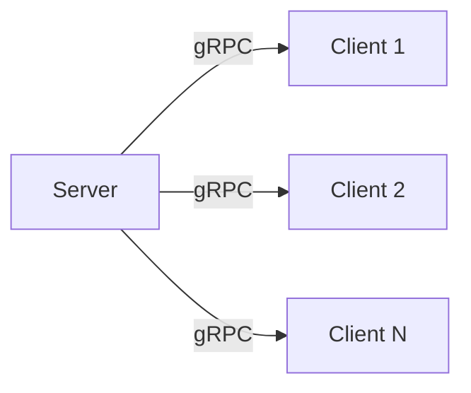

# Go-Device-Monitor

## Introduction
Go-Device-Monitor is a cutting-edge tool designed to transform your devices into IoT endpoints, allowing for real-time monitoring, usage tracking, and preventive maintenance to avoid failures.

## Architecture
This project leverages a client-server model using gRPC for communication, enabling multiple clients (devices) to connect to a central server for data aggregation and analysis. The architecture is visualized below using a Mermaid diagram:




## Protocol Buffuers:

```shell
protoc --go_out=server --go_opt=paths=source_relative \
       --go-grpc_out=server --go-grpc_opt=paths=source_relative \
       --go_out=client --go_opt=paths=source_relative \
       --go-grpc_out=client --go_grpc_opt=paths=source_relative \
       proto/monitoring.proto
```

This command will generate the Go gRPC code for both the client and server, based on the definitions in proto/monitoring.proto.

## Dependencies:

To start using gRPC in your Go project, you'll need to install the google.golang.org/grpc package. Run the following command in your project directory:


```shell
go get google.golang.org/grpc
```


